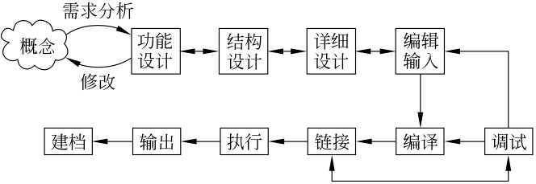
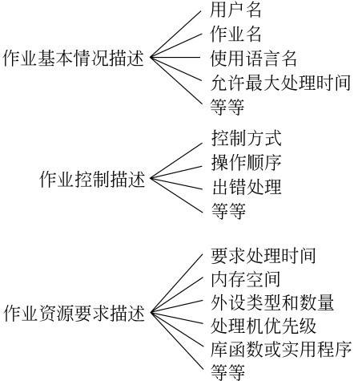
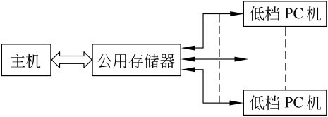
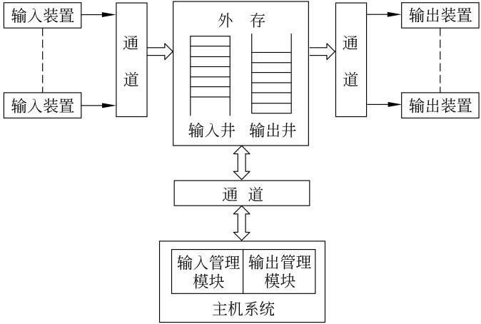
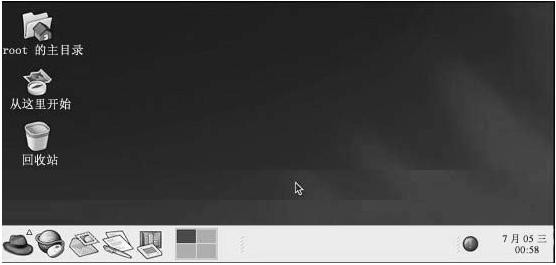
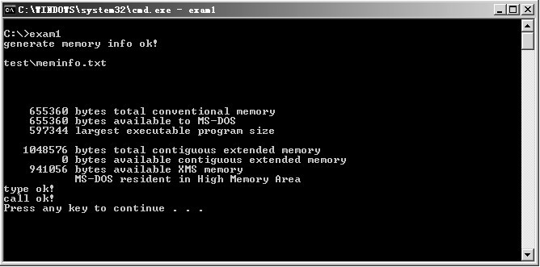
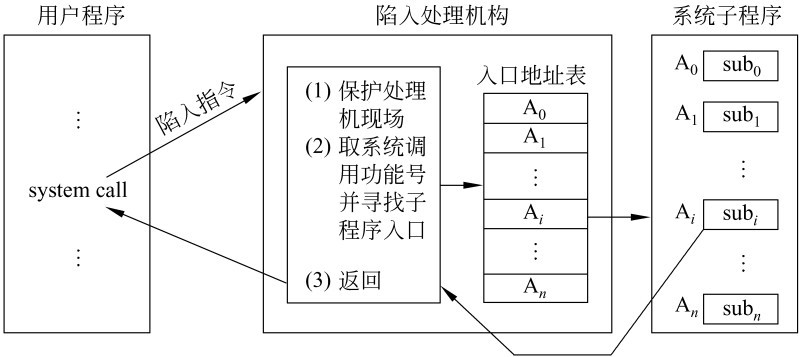

%%%%%%%%%%%%%%%%%%%%%%%%%%%%%%%%%%%%%%%%%%%%
%  PPT头
title: 操作系统
subtitle: 操作系统用户界面
author: 丘文峰 
%%%%%%%%%%%%%%%%%%%%%%%%%%%%%%%%%%%%%%%%%%%%

2.1 简介
=======

用户界面是操作系统的重要组成部分，用户界面负责用户和操作系统之间的交互。

#### 三种用户

- 普通用户 ， 计算机应用服务， 例如 事务处理， 过程控制
- 管理员用户， 计算机系统安全
- 程序开发人员， 开发APP

#### 操作系统的用户界面针对核心用户不同，且具有时效性

#### 概念

操作系统的操作命令界面作为命令控制界面， 也称为命令提示符。

2.2 一般用户的输入输出界面
=======================

#### 作业的定义

- 从输入开始到输出结束，用户要求计算机所做的有关该次业务处理的全部工作称为一个作业。
- 作业由不同的顺序相连的作业步组成。
- 作业步是在一个作业的处理过程中计算机所做的相对独立的工作。
- 一般来说，每一个作业步产生下一个作业步的输入文件。★
- 作业由程序、数据和作业说明书组成， 在批处理系统中，作业是抢占内存的基本单位。

2.2.2 作业组织
=============

#### 作业说明书

作业说明书包含三方面

- 作业的基本描述
- 作业控制描述
- 作业资源要求描述

#### [批处理文件（.bat）示例](http://baike.baidu.com/view/295769.htm)

2.2.3 一般用户的输入输出方式
=========================

#### 5种输入输出方式

- 联机输入输出方式， 用于用户与系统的实时交互
- 脱机输入输出方式， 为了解决设备联机输入输出时速度太慢问题
- 直接耦合方式， 解决脱机输入输出方式的人工干预缺点
- SPOOLING系统
- 网络联机方式，在网络下使用上述四种方式

2.2.3 直接耦合方式
================

在直接耦合方式中，慢速的输入输出过程仍由外围机自己管理，而对公用存储器中的大量数据的高速读写则由主机完成。直接耦合方式需要一个大容量的公用存储器，把多台外围机、主机和公用存储器固定连接起来。

2.2.3 SPOOLING系统
=================

2.3 命令控制界面
==============

#### 两个接口界面

- 系统为用户提供的各种命令接口
- 系统调用

#### 操作系统的命令控制界面就是用来组织和控制作业运行的

#### 作业控制的主要方式有两种

- 脱机方式，不可交互， 批处理
- 联机方式，可交互， 命令行

2.3 联机方式的命令
===============

#### 命令大致可以分为以下7类

- 环境设置
- 执行权限管理
- 系统管理
- 文件管理
- 编辑、编译、链接装配和执行编辑命令被用来帮助用户输入用户文件。
- 通信
- 资源要求

2.4 Linux命令控制界面
====================

2.4 Linux命令控制界面
===================

#### 一般来说， Linux命令主要包括以下9类:
 
- 系统维护及管理命令， 例如 date, setenv等
- 文件操作及管理命令， 例如 ls, find等
- 进程管理命令， 例如kill, at等
- 磁盘及设备管理命令， 例如df, du, mount等
- 用户管理命令， 例如adduser, userdel等
- 文档操作命令， 例如csplit, sort等
- 网络通信命令， 例如netstat, ifconfig等
- 程序开发命令， 例如cc, link等
- X Window管理命令, 例如startx, XE86Setup等

2.4 Shell程序
============

#### 一个Shell程序由以下6部分组成

- 命令或其他Shell程序 
- 位置参数
- 变量及特殊字符
- 表达式比较
- 控制流语句， 例如while, case等
- 函数

<% code do  %>
mkdir backup
for filein 'ls'
do
	cp $file backup/ $ file
	if [$ > -ne 0] then
		echo "copying $ file error"
	fi
done
<% end %>

2.4.2 Windows的命令控制界面
=========================

#### Windows通过自带的命令行解释器cmd.exe为用户提供交互：

- 系统信息命令， 例如Time, Data, Mem, Diverquery和SystemInfo等
- 系统操作命令， 例如Shutdown, Runas和Taskkill等
- 文件系统命令， 例如Copy, Del和Mkdir等
- 网络通信命令， 例如Ping, Netstat和Router等

#### 命令格式

- 运行一条命令，接着运行第二条命令: Command1 & Command2
- 成功运行一条命令，才运行第二条命令: Command1 && Command2
- 失败运行一条命令， 才运行第二条命令: Command1 || Command2
- 分组和嵌套命令： (Command1 & Command2)
- 参数： Command parameter1;parameter2

2.4.2 Windows的命令控制界面
=========================
<% code do  %>
systeminfo & mem
<% end %>
<% code do  %>
@echo off 
mkdir test
echo hello
pause
<% end %>

2.4.2 一个批处理例子
=================

<% code do  %>
exam2.bat:
			@echo off
			mem>%1/meminfo.txt
			echo generate memoryinfo Ok!
exam3.bat:
			@echo off
			type %1\*.txt
			echo type ok!

exam1.bat:
			@echo off
			mkdir test
			call exam2.bat test
			call exam3.bat test
			echo call OK!
			pause
<% end %>

2.4.2 一个批处理例子
=================

2.5 系统调用
===========

#### 系统调用大致可分为6大类

- 设备管理
- 文件管理
- 进程控制
- 进程通信
- 存储管理
- 线程管理

#### 陷阱

在系统中为控制系统调用服务的机构称为陷阱处理机构

#### 陷阱指令（访管指令）

由于系统调用引起处理机中断的指令称为陷阱指令（或称为访管指令）

2.5 系统调用
===========

#### 用户态与系统态

一般把处理机在用户程序中执行称为用户态，而把处理机在系统程序中执行称为系统态。

2.6 Linux的系统调用
==================

#### Linux由两部分组成：

- 核心函数，部分提供实现系统调用功能的共享代码，作为操作系统的核心程序驻留在内存中
- 接口函数，部分提供给应用程序API接口，它把系统调用号，入口参数地址传送给相应的核心函数

#### Linux系统调用，大致可分为如下6类:

- 设备管理的系统调用
- 文件系统操作的系统调用
- 进程控制的系统调用
- 存储管理的系统调用
- 管理用的系统调用
- 通信的系统调用

2.6 Linux的系统调用
=================

<% code do  %>
#include <fcntl.h>
#include <sys/stat.h>
#define SIZE 1

void filecopy(char* infile, char * outfile)
{
	char Buffer[SIZE];
	int in_fh, out_fh, count;
	if (in_fh = open(infile, O_RDONLY))==-1) // 以只读模式打开输入文件
		printf("Opening infile");
	if (out_fh = open(outfile, (O_WRONLY|O_CREAT|O_TRUNC), 
		(S_IRUSER|S_IWUSR))==-1)	//以读写模式新建一个文件
		printf("Opening outfile");
	while((count == read(in_fh, Buffer, sizeof(Buffer)))>0)
		if (write(out_fh, Buffer, count)!=count) // 复制
			printf("Writing date");
	if (count==-1)
		printf("Reading date");
	close(in_fh); // 关闭输入文件
	close(out_fh); // 关闭输出文件
}
<% end %>

2.6.2 Windows系统调用
====================

#### Windows通过提供API进行系统调用，共有5类

- 窗口管理类
- 图形设备接口类
- 系统服务类
- 国际特性类
- 网络服务类

2.6.2 Windows系统调用
====================

<% code do  %>
#include <windows.h>
//入口函数
int WINAPI WinMain(HINSTANCE hInstance, HINSTANCE hPrevInstance, 
				PSTR szCmdLine, intiCmdshow)
{
	HANDLE hFile;
	LPTSTR lpBuffer="Hello World!";
	// 创建文件
	hFile = CreateFile("C:\\File.txt", GENERIC_READ | GENERIC_WRITE, 
		0, NULL, OPEN_ALWAYS, FILE_ATTRIBUTE_NORMAL, NULL);
	CloseHandle(hFile);
	TCHAR szBuf[128];
	DWORD dwRead;
	DWORD dwWritten;
	// 打开文件
	hFile = CreateFile("C:\\File.txt", GENERIC_READ | GENERIC_WRITE, 
		0, NULL, OPEN_ALWAYS, FILE_ATTRIBUTE_NORMAL, NULL);
	// 向文件写入一个字符串
	WriteFile(hFile, IpBuffer, strlen(IpBuffer)+1, &dwRead, NULL);
	SetFilePointer(hFile, 0, NULL, FILE_BEGIN);
	// 从文件中读出一个字符串并将它显示在对话框中
	if (ReadFile(hFile, szBuf, strlen(ipBuffer)+1, &dwWritten, NULL))
	{
		MessageBox(NULL, szBuf, "EXAM", MB_OK);
	}
	CloseHandle(hFile);
}

<% end %>

作业
===
使用Windows系统调用写一个拷贝文件夹的程序