%%%%%%%%%%%%%%%%%%%%%%%%%%%%%%%%%%%%%%%%%%%%
%  PPT头
title: 操作系统
subtitle: 进程管理
author: 丘文峰 
%%%%%%%%%%%%%%%%%%%%%%%%%%%%%%%%%%%%%%%%%%%%

3.1 进程的概念
=============

#### 现代操作系统的特点

- 程序并发执行
- 资源共享
- 用户随机使用系统

#### 这三者是互相联系和互相依赖的

#### 操作系统的重要任务之一是使用用户充分、有效地利用系统资源

#### 如何抽象？ -- 进程 

3.1.1 程序的并发执行
==================

#### 程序

程序用来描述计算机所要完成的独立功能，并在时间上严格按前后次序相继地进行计算机操作序列集合。

#### 程序的顺序执行

<% code do  %>
Repeat iR ← M[PC]
	pc ← pc+1
	< Execute (instructioniniR)>
Until CPU halt
<% end %>

- 把一个具有独立功能的程序独占处理机直至最终结束的过程称为程序的顺序执行

3.1.1 多道程序系统中的程序执行
===========================

#### 程序顺序执行的特点

- 顺序性
- 封闭性
- 可再现性

#### 执行环境要求满足以下3个特点

- 独立性
- 随机性
- 资源共享性

3.1.1 程序的并发性（concurrent）
==============================

#### 并发执行

- 所谓并发执行，是为了增强计算机系统的处理能力和提高资源利用率所采取的一种同时操作技术。
- 多道程序间的并发执行
- 同一程序间代码的并发执行
- 程序的并发执行不同于程序的并行执行

#### 并发执行的过程描述

<% code do  %>
S0
Cobegin
P1;P2;...;Pn
Coend
<% end %>

3.1.1 并发执行的条件
==================

> 1966年Bernstein提出了两相邻语句S1,S2可以并发执行的条件：若一语句读的变量与另一语句写的变量没有交集，且两条语句写的变量也没有交集，那么这两条语句是可以并发的。

#### 程序并行带来的影响

- 并发执行的好处是提高系统资源利用率
- 并发执行的不足是导致资源的共享和竞争问题，使程序失去封闭性和可再现性

3.1.1 一个并发执行的例子
=====================

<% code do  %>
procedure getaddr(top)
	begin
		local r
		r ← (top)
		top ← top-1
		return r
	end

procedure reladdr(blk)
	begin
		top ← top+1
		(top) ← blk
	end
<% end %>

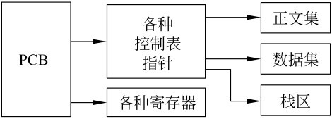

#### 错误是由于两程序共享资源堆栈S导致

3.1.1 小结
==========

- 由于程序的顺序性，静态性以及孤立性，用程序段作为描述其执行过程和共享资源的基本单位是不合适的
- 进程是描述程序的执行过程且能用来共享资源的基本单位

3.1.2 进程的定义
===============

#### 进程的5个定义

- 进程是可以并发执行的计算部分
- 进程是一个独立的可以调度的活动
- 进程是一抽象实体，当它执行某个任务时，将要分配和释放各种资源
- 行为的规则叫程序，程序在处理机上执行时的活动称为进程
- 一个进程是一系列逐一执行的操作，而操作的确切含义则有赖于以何种详尽程序来描述进程

#### 并发执行的程序在执行过程中分配和管理资源的基本单位

3.1.2 进程和程序
===============

#### 既有区别也有联系

- 进程是一个动态概念，而程序是一个静态概念
- 进程具有并发特征，而程序没有。进程具有并发特征的两个方面，即独立性和异步性。
- 进程是竞争计算机系统资源的基本单位
- 不同的进程可以包含同一程序

3.2 进程的描述
==============

- 系统通过进程控制块PCB描述进程存在，并反映其变化的物理实体
- 进程的PCB是系统感知进程的唯一实体
- 进程PCB结构都是全部或部分常驻内存

3.2.1 进程控制块PCB
==================

#### PCB是进程存在和死亡的标志
#### PCB的内容
	
- 描述信息 进程名或进程标识号， 用户名或用户标识号， 家庭关系
- 控制信息 进程当前状态， 进程优先级， 程序开始地址， 各种计时信息， 通信信息
- 资源管理器 内存管理， 对换和覆盖信息 共享程序段，输入输出设备号， 文件系统指针
- CPU现场保护结构

3.2.2 进程上下文
===============

#### 进程上下文实际上是进程执行过程中顺序关联的静态描述。

- 每个进程执行过、执行时的以及待执行的指令和数据
- 在指令寄存器、堆栈、状态字寄存器的内容

#### 上文

已执行过的进程指令和数据在相关寄存器与堆栈中的内容

#### 正文

把正在执行的指令和数据在寄存器与堆栈中的内容

#### 下文

把待执行的指令和数据在寄存器与堆栈的内容

3.2.2 进程上下文（2）
====================

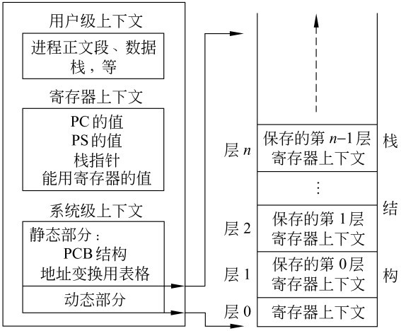

#### 进程的系统级上下文

- 静态部分 PCB结构，地址映射表格，核心栈
- 动态部分 与寄存器上下文相关联

3.2.2 UNIX System V进程上下文
============================

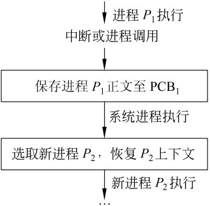

3.2.3 进程上下文切换
==================

#### 上下文切换的三个部分

- 保存被切换进程的正文部分至有关存储区
- 操作系统进程中有关调度和资源分配程序执行
- 被选中进程的原来被保存的正文部分从有关存储区中取出，并送至有关寄存器与堆栈中，激活选中进程执行

#### 上下文切换是一个十分耗时的过程

3.2.4 进程空间与大小
=====================

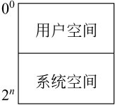 

#### 用户模式与系统模式

3.3 进程状态
=============

进程的5种基本状态：

- 初始态
- 执行态
- 阻塞态（等待状态）
- 就绪态
- 终止态

3.3.2 进程状态的转换
===================

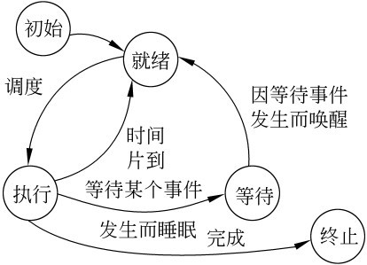 

3.4 进程控制
===========

#### 定义

- 进程控制，就是系统使用一些具有特定功能的程序段来创建、撤销进程以及完成进程各状态间的转换，从而达到多进程高效率并发执行和协调、实现资源共享的目的。

#### 原语

- 不允许中断的指令或程序段
- 原语执行于系统态，用于完成操作系统某些特定功能

3.4.1 进程的创建
==============

#### 进程创建的两种方式

- 由系统程序模块统一创建， 在批处理系统中
- 由父进程创建

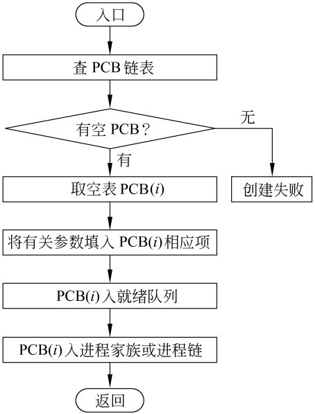

3.4.1 进程的撤销
================

#### 进程撤销的3种情况

- 该进程已完成所要求的功能而正常终止
- 由于某种错误导致非正常终止
- 祖先进程要求撤销某个进程

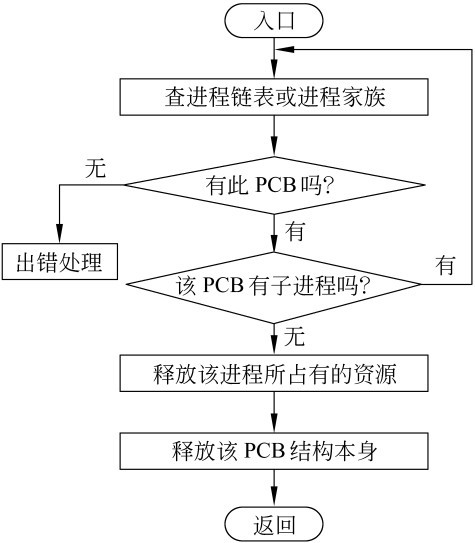

3.4.2 进程的阻塞
===============

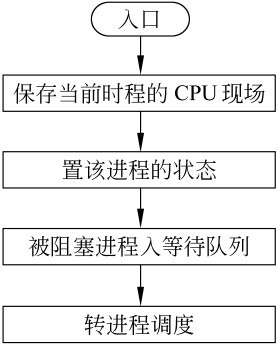

3.4.2 进程的唤醒
================

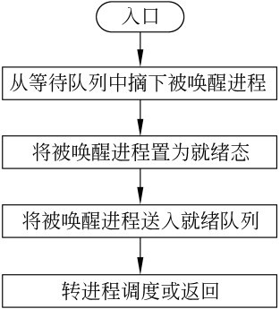

3.5 进程互斥
===========

#### 并发执行受资源有限性制约

- 进程并发特征（独立性和异步性），导致执行随机和提高资源利用率
- 进程执行过程受资源有限约束

#### 资源有限约束

- 临界区 程序在任何时刻可中断；可并发执行的三个条件的检验是不可能的；
- 一个例子
- 概念：把不允许多个并发进程交叉执行的一段程序称为临界部分或临界区
- 临界区由属于不同并发进程的程序段共享公用数据或公用数据变量引起的

3.5.1 临界区的例子
================

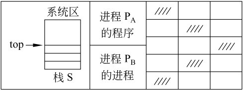
 
<% code do  %>

getspace: begin local g
		g ← stack[top]
		top ← top-1
		end

release(ad):begin
		top ← top+1
		stack[top] ← ad
end
<% end %>

3.5.1 间接制约
=============

#### 临界区集合

一般来说，可以把那些不允许交叉执行的临界区按不同的公用数据划分成为不同的集合，把这些集合称为临界区集合。例如上例中，以公用数据栈S划分的临界区集合是{getspace, release}。

#### 临界区的描述

<% code do  %>
when <类名> do <临界区> od
<% end %>

3.5.1 间接制约
=============
#### 例子

<% code do  %>

getspace: when sp do getspace ← stack[top]
		top ← top-1
		od

release(ad):when sp do top ← top+1 
		stack[top] ← ad
		od
<% end %>

#### 由于共享资源不允许并发进程交叉执行，称为间接制约

#### 解决共享资源而引发的间接制约采用， 互斥

3.5.2 互斥
=========

#### 定义

一组并发进程的一个或多个程序段，因共享某一公有资源而导致它们必须以一个不允许交叉执行的单位执行。即，不允许两个以上的共享该资源的并发进程同时进入临界区，称为互斥

#### 互斥执行的四个原则

- 不能假设各个并发进程的相对执行速度
- 进程不能阻止其他进程进入临界区
- 只能允许一个进程进入临界区
- 并发进程应在有限时间内进入临界区

3.5.2 临界区
===========

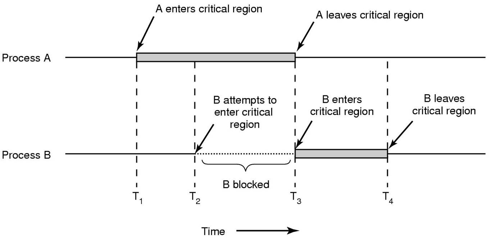

3.5.2 忙等待的互斥
================

<% code do  %>
lock(x)=begin local x
	repeat
		v ← x
	until v = 1
	x ← 0
<% end %>

<% code do  %>
unlock(x)=begin x←1 end
<% end %>

#### 缺点： 违反了第3原则（为什么）

3.5.2 原始解法
=============

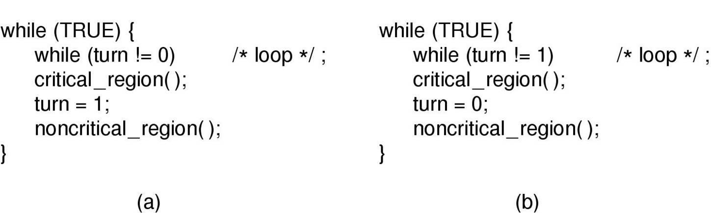

3.5.2 Peterson解法
=================
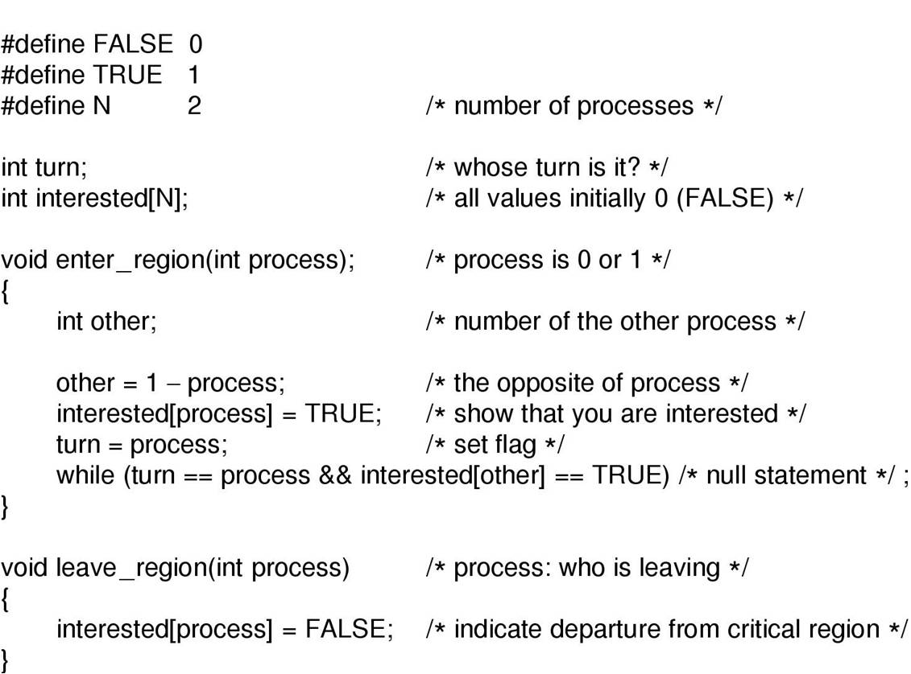

3.5.2 TSL指令
============
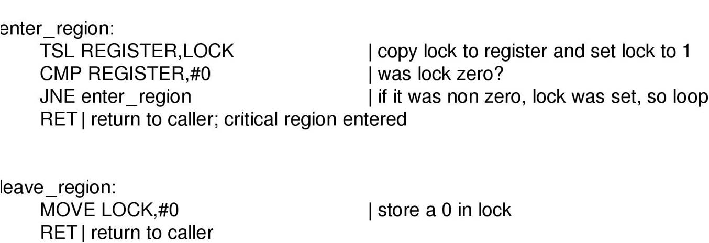

3.5.3 生产者和消费者问题
======================

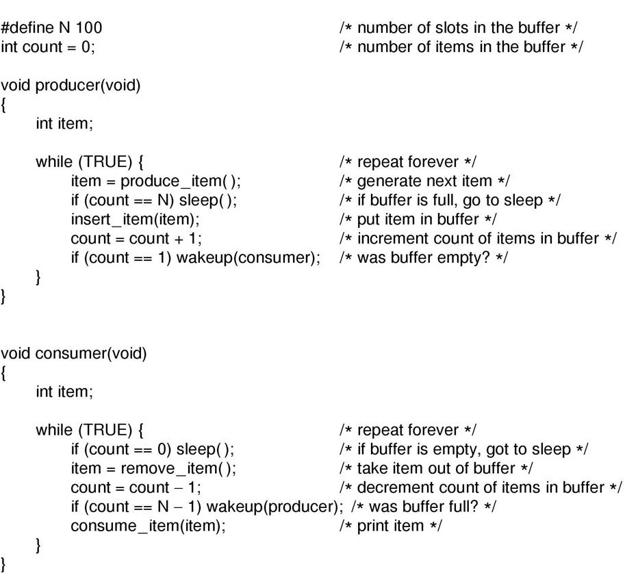

3.5.3 信号量
=============

#### 采用锁机制，会导致严重的性能问题及不公平现象

#### 一个例子

<% code do  %>
PA
	A: lock(key[S])
		<S>
		unlock(key[S])
		Goto A
PB	
	B: lock(key[S])
		<S>
		unlock(key[S])
		Goto B
<% end %>

#### 如何解决不公平问题（引入第三方监督）

3.5.3 信号量（2）
===============

#### 最早由E.W.Dijkstra提出

#### 信号量类似交通信号灯：红灯停，绿灯行

#### 信号量的含义 

- 为一整数
- 大于或等于0时代表可供并发进程使用的资源实体数
- 小于0则表示等待使用临界区的进程数
- 初始值为非负数

3.5.3 PV原语
===============

#### P原语

- SEM减1
- 若SEM减1后仍大于或等于0，则P语言返回，进程继续执行
- 若SEM减1后小于0，进程阻塞

3.5.3 PV原语
===============
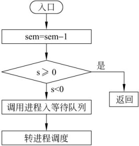

3.5.3 PV原语
===============
#### V原语

- SEM加1
- 若相加结果大于0，V原语停止执行，。进程返回调用处
- 若相加结果小于或等于0，则该信号的等待队列中唤醒一个等待进程，返回再返回原进程继续执行或转进程调度

3.5.3 PV原语
===============
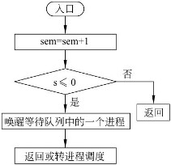

#### PV操作必须采用原语实现

3.5.3 P原语的实现
===================
<% code do  %>
P(sem)
	begin
		封锁中断;
		lock(lockbit);
		val[sem]=val[sem]-1;
		if val[sem]<0
			保护当前进程CPU现场
			当前进程状态置为“等待”
			将当前进程插入信号SEM等待队列
			转进程调度
		fi
		unlock(lockbit):开放中断
	end
<% end %>

3.5.3 V原语的实现
===================
<% code do  %>
P(sem)
	begin
		封锁中断;
		lock(lockbit);
		val[sem]=val[sem]+1;
		if val[sem]≤0
			local k
			从sem等待阶列中选取一等待进程，将其指针置入k中
			将k插入就绪队列
			进程状态置为“就绪"
		fi
		unlock(lockbit):开放中断
	end
<% end %>

3.5.4 用PV原语实现进程互斥
=======================

#### 步骤

- 设SEM为互斥信号量，其取值范围为(1,0,-1)
- 描述进程

<% code do  %>
PA:
	P(SEM)
	<S>
	V(SEM)
	...

PB: 
	P(SEM)
	<S>
	V<SEM>
<% end %>