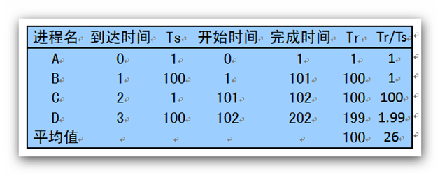
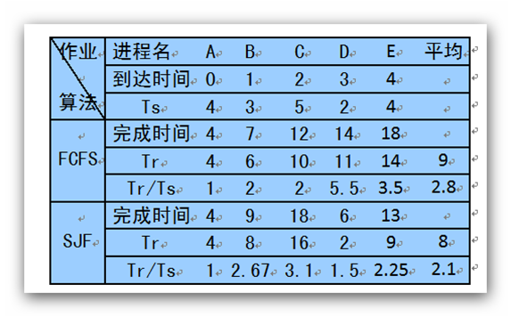
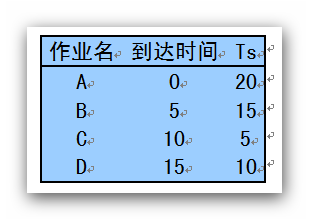
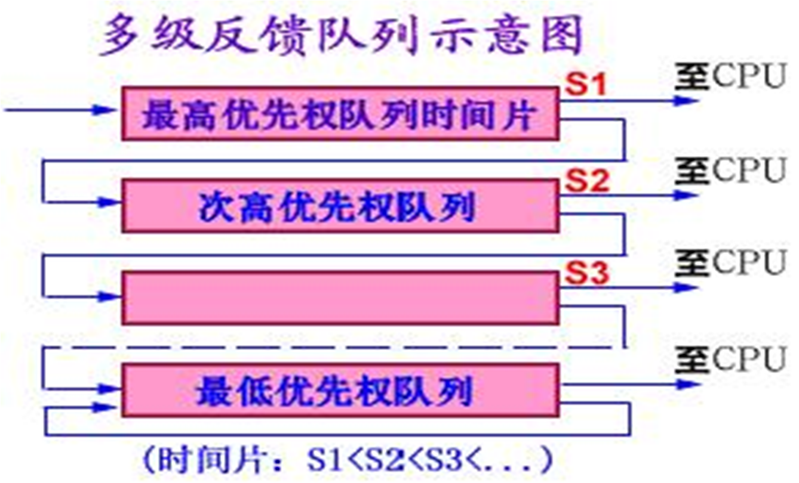
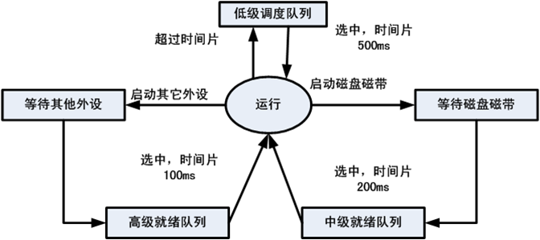
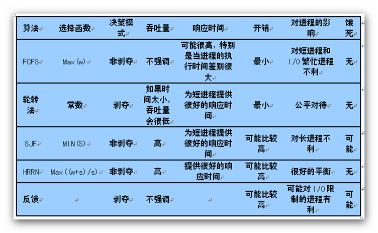

%%%%%%%%%%%%%%%%%%%%%%%%%%%%%%%%%%%%%%%%%%%%
%  PPT头
title: 操作系统
subtitle: 处理机调度
author: 丘文峰 
%%%%%%%%%%%%%%%%%%%%%%%%%%%%%%%%%%%%%%%%%%%%

4.4 调度算法
=============

#### 本节讨论各种常用的进程调度算法和作业调度算法

- 先来先服务(FCFS)调度算法
- 轮转法
- 多级反馈轮转法
- 优先级法
- 最短作业优先法
- 最高响应比优先法
- [开源的仿真器](http://cpuss.codeplex.com/)
- [算法可视化工具](http://www.cs.usfca.edu/~galles/visualization/)

先来先服务(FCFS)调度算法
=========================

#### 原理

- 把就绪状态的进程按进入的先后以队列方法排列
- 按照先来先服务的方式进行调度处理

#### 优点

- 看似最“公平”， 操作简单

#### 缺点

- 比较有利于长作业（进程），不利于短作业（进程）

先来先服务(FCFS)调度算法
=========================

最短作业优先法
================

#### 原理

- 选择估计需要执行时间最短的作业投入执行

#### 优点

- 比FCFS改善平均周转时间和平均带权周转时间，缩短作业的等待时间
提高系统的吞吐量

#### 缺点

- 对长作业非常不利，可能长时间得不到执行
- 未能依据作业的紧迫程度来划分执行的优先级
- 难以准确估计作业（进程）的执行时间，从而影响调度性能

FCFS与SJ(P)F的对比
==================

高优先权优先调度算法
===================

#### 原理

- FCFS算法与SJF算法都是比较片面的调度算法。
- FCFS算法只考虑作业的等候时间，而忽视了作业的等待时间。
- 而SJF恰好与之相反，它只考虑用户估计的作业计算时间而忽视了作业的等待时间。
- 高优先权优先调度算法是介乎两者之间的折衷策略。

高优先权优先调度算法
===================

####  优先权调度算法的类型
- 非抢占式优先权算法，主要用于批处理系统中
- 抢占式优先权算法， 常用于要求比较严格的实时系统，以及对性能要求较高的批处理和分时系统中

高优先权优先调度算法
===================

#### 根据优先权的类型

- 静态优先数：进程类型、进程对资源的需求 、用户要求
- 静态优先数优点：简单易行，缺点：不精确，可能饿死
- 动态优先数 随时间推进，等待作业或进程的优先数提高，执行作业或进程的优先数降低，以抢占式实现

最高响应比优先法
================

- 高响应比实际就是以响应比作为动态优先数进行调度的
- 响应比=作业响应时间/作业估计计算时间
- 响应比=1+作业等待时间/作业估计算时间

实例：SJF、FCFS和HRRF
===================

- 

解答 SJF
========

- 作业调度顺序为作业A、C、D、B
- T= (20+25-10+35-15+50-5)/4=25
- W=(20/20+15/5+20/10+45/15)/4=2.25
- 其中 T代表平均作业周转时间，W代表平均带权作业周转时间

解答 FCFS
=========

- 作业调度顺序为作业A、B、C、D
- T=(20+35-5+40-10+50-15)/4=28.75
- W=(20/20+35/15+30/5+35/10)/4=3.125

解答 HRRF
========

- 开始时只有作业A，作业A选中，执行时间20
- 作业A执行后,响应比依次1+15/5, 1+10/5，1+5/10，作业C选中，执行时间5
- 作业C执行后，响应比依次是1+20/15, 1+10/10，作业B选 中，执行时间15
- 作业B执行后，作业D选中，执行时间10

解答 HRRF
========

- 作业调度次序为A, C, B, D
- T=(20+25-10+40-5+50-15)/4=26.25
- W=(20/20+15/5+35/15+35/10)/4=2.46
- 可见，HRRF性能界于SJF和FCFS之间

基于时间片的轮转调度算法
=====================

#### 原理

- 前面3种算法主要用于宏观调度，说明怎样选择一个进程或作业开始运行，开始运行后的作法都相同，即运行到结束或阻塞，阻塞结束时等待当前进程放弃CPU 。
- 本算法主要用于微观调度，说明怎样并发运行，即切换的方式；设计目标是提高资源利用率。
- 其基本思路是通过时间片轮转，提高进程并发性和响应时间特性，从而提高资源利用率；

基于时间片的轮转调度算法
=====================

#### 原理

- 时间片轮转算法基本原理
- 将系统中所有的就绪进程按照FCFS原则，排成一个队列。
- 每次调度时将CPU分派给队首进程，让其执行一个时间片。时间片的长度从几个ms到几百ms
- 在一个时间片结束时，发生时钟中断。
- 调度程序据此暂停当前进程的执行，将其送到就绪队列的末尾，并通过上下文切换执行当前的队首进程。
- 进程可以未使用完一个时间片，就出让CPU（如阻塞）。

基于时间片的轮转调度算法
=====================

#### 时间片大小的确定

#### 时间片长度变化的影响

- 过长－>退化为FCFS算法，进程在一个时间片内都执行完，响应时间长。
- 过短－>用户的一次请求需要多个时间片才能处理完，上下文切换次数增加，响应时间长。

#### 对时间大小的划分：
- 时间片略大于一次典型的交互所需的时间.

#### 时间片长度的影响因素：
- 就绪进程的数目：数目越多，时间片越小（当响应时间一定时）
- 系统的处理能力：应当使用户输入通常在一个时间片内能处理完，否则使响应时间，平均周转时间和平均带权周转时间延长。

多级队列算法(Multiple-level Queue)
=================================

- 本算法引入多个就绪队列，通过各队列的区别对待，达到一个综合的调度目标；
- 根据作业或进程的性质或类型的不同，将就绪队列再分为若干个子队列。
- 每个作业固定归入一个队列。
- 各队列的不同处理：不同队列可有不同的优先级、时间片长度、调度策略等。如：系统进程、用户交互进程、批处理进程等

多级队列算法(Multiple-level Queue)
=================================

- 

多级队列算法(Multiple-level Queue)
=================================

- 

各种调度策略的特点
================

- 

实时系统调度方法
==============

#### 实时系统与其他系统的区别

- 处理和控制的正确性除了计算逻辑结果，还取决于计算和处理结果产生的时间。

#### 分类

- 硬实时任务： 要求系统必须完全满足任务的时限要求
- 软实时任务： 允许系统对任务的时限要求有一定的延迟，时限要求只是一个相对条件
- 非周期性任务： 必定存在有一个完成或开始进行处理的时限
- 周期性作任务： 要求在周期T内完成或开始进行处理

实时操作系统的特点
================

#### 特点如下

- 有限等待时间（决定性）
- 有限响应时间
- 用户控制
- 可靠性高
- 系统出错处理能力强

实时操作系统与分时操作系统
=======================

#### 决定性

- 分时系统中并发执行的进程具有不确定性，其执行顺序与执行环境有关
- 实时系统要求所有的进程处理事件时，都必须在有限时间内开始处理，这一特性称为实时系统的决定性

#### 有限响应

- 实时系统有限响应时间特性是指从系统响应外部事件开始，必须在有限时间内处理完毕

#### 进程调度控制

- 分时系统用户汉有参与进程调度控制
- 实时系统，用户可以控制进程的优先级并选择相应的调度算法，从而达到对进程执行先后顺序的控制

实时操作系统与分时操作系统
=======================

#### 可靠性

#### 错误处理不能影响正在执行的用户应用

实时操作系统的能力
===============

#### 很快的进程或线程切换速度

#### 快速的外部中断响应能力

#### 基于优先级的随时抢先调度策略

- 优先级+时间片轮转调度策略， 不适用
- 基于优先级的非抢先式调度策略， 不适用
- 基于优先级的固定点抢先式调度策略， 适用
- 基于优先级的随时抢先式调度策略， 适用

实时调度算法的分类
=================

#### 实时调度算法分为4类

- 静态表格驱动类， 
- 静态优先级驱动抢先式调度算法类
- 动态计划调度算法类
- 尽力而为调度算法类

时限调度算法与频率单调调度算法
===========================

- 任务就绪时间或事件到达时间
- 开始时限
- 完成时限
- 处理时间
- 资源需求
- 优先级

