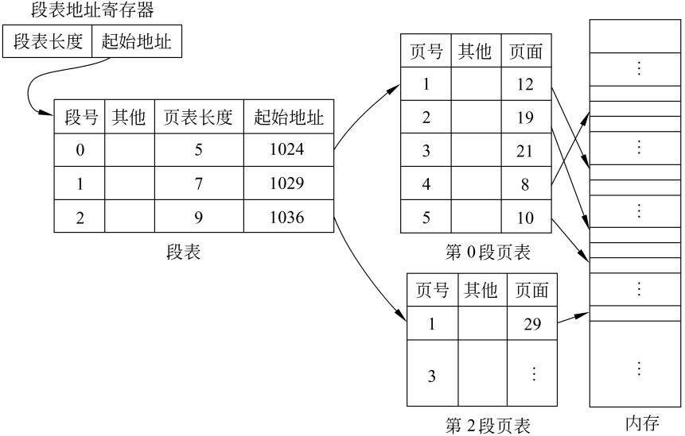

%%%%%%%%%%%%%%%%%%%%%%%%%%%%%%%%%%%%%%%%%%%%
%  PPT头
title: 操作系统
subtitle: 存储管理
author: 丘文峰 
%%%%%%%%%%%%%%%%%%%%%%%%%%%%%%%%%%%%%%%%%%%%

5.1 存储管理的功能
================

#### 内存的重要性

- 存储器是计算机系统的重要资源之一，任何程序必须占用一定存储空间
- 存储器分为内存和外存。
- 所有程序执行必须获得内存空间

#### 本章讨论问题

- 内存管理方法
- 内存的分配和释放算法
- 虚拟存储器的概念
- 控制主存和外存之间的数据流动方法
- 地址变换技术和内存数据保护与共享技术

5.1.1 虚拟存储器
===============

#### 一个实验结果

- 在一个进程的执行过程中，其大部分程序和数据并不经常被访问

#### 两种安排目标代码地址的方法

- 物理地址
- 虚拟地址

5.1.1 虚拟地址的变换
===================

#### 地址变换是操作系统要解决的问题
- 

5.1.1 一些基本原理
=================

#### 虚拟存储器

- 将进程中的目标代码、数据等的虚拟地址组成的虚拟空间称为虚拟存储器
- 每个进程都拥有自己的虚拟存储器，且虚拟存储器的容量是由计算机的地址结构和寻址方式确定。

5.1.2 地址变换
=============

#### 内存地址的集合称为内存空间或物理地址空间

#### 要解决的问题

- 虚拟空间的划分问题
- 
- 虚拟空间中已链接和划分好的内容装入内存，并将虚拟地址映射为内存地址的问题，称之为地址重定位或地址映射

5.1.2 静态地址重定位
===================

#### 静态地址重定位的定义

- 是在虚拟空间程序执行之前由装配程序完成地址映射工作

#### 静态地址重定位的过程

#### 静态重定位的优点 

- 不需要硬件支持

#### 静态重定位的缺点 

- 无法实现虚拟内存
- 必须占用连续的内存空间

# 5.1.2 动态地址重定位 #

#### 动态地址重定位 

- 是在程序执行过程中，在CPU访问内存之前，将要访问的程序或数据地址转换成内存地址。
- 需要硬件支持

#### 动态重定位公式 

- MA=BR+VR

# 5.1.2 动态重定位的过程 #

####过程如下

- 设置基地址寄存器BR,虚拟地址寄存器VR
- 将程序段装入内存，且将其占用的内存区首地址送BR中
- 在程序执行过程中，将所要访问的虚拟地址送入VR中
- 地址变换机构把VR和BR的内容相加，得到实际访问的物理地址

- 

# 5.1.2 动态重定位的优点 #

#### 优点

- 可以对内存进行非连续分配 
- 动态重定位提供了实现虚拟存储器的基础
- 有利于程序段的共享

# 5.1.3 内外存数据传输控制 #

#### 基本控制方法

- 用户程序自己控制， 覆盖
- 操作系统控制， 一种是交换方式， 另一种是请求调入方式和预调入方式

#### 操作系统控制

- 交换方式由操作系统把那些在内存中处于等待状态的进程换出内存，而把那些等待事件已经发生，处于就绪状态的进程换入内存。（特点：不进行部分交换）
- 请求调入方式是在程序执行时，如果所要访问的程序段或数据段不在内存中，则操作系统自动地从外存将有关的程序段和数据段调入内存的一种操作系统控制方式
- 预调入则是由操作系统预测在不远的将来会访问到的那些程序段和数据段部分，并在它们被访问之前系统选择适当的时机将它们调入内存的一种数据流控制方式

# 5.1.4 内存的分配与回收 #

#### 内存分配和收的5种策略和数据结构

-  分配结构 登记内存使用情况，供分配程序使用的表格与链表， 例如内存空闲区， 空闲队列
-  放置策略 确定调入内存和程序和数据在内存中的位置， 这是一种选择内存空闲区的策略
-  交换策略 在需要将某个程序段和数据调入内存时，如果内存中没有足够的空闲区，由交换策略来确定把内存中的哪些程序段和数据段调出内存，以便腾出足够的空间
-  调入策略 外存中和程序段和数据段什么时间按什么样的控制方式进入内存
-  回收策略 回收策略包括两点，一是回收的时机， 二是对所回收的内存空闲区和已存在的内存空闲区的调整

# 5.1.5 内存信息的共享与保护 #

#### 常用的内存信息保护方法

- 硬件法，上下界保护法
- 软件法， 保护键法
- 软硬件结合， 保护模式

# 5.1.5 内存信息的共享与保护 #

# 5.1.5 内存信息的共享与保护 #

# 5.2 分区存储管理 #

#### 定义
-  分区管理是把内存划分成若干个大小不等的区域，除操作系统占用一个区域之外，其余由多道环境下的各并发进程共享
- 分区管理是满足多道程序设计的一种最简单的存储管理方法

# 5.2.1 分区管理基本原理 #

#### 基本原理

- 给每一个内存中的进程划分一个适当大小的存储区，以连续存储各进程的程序和数据，使各进程得以并发执行

#### 分类

- 固定分区
- 动态分区

# 固定分区法 #

#### 定义

- 固定分区法就是把内存区固定地址划分成若干个大小不等的区域
- 分区划分一般由系统操作员或操作系统完成
- 分区一旦划分，整个执行过程中每个分区的长度和内存的总分区个数将保持不变
- 数据结构：分区表（分区号，分区大小，起始地址和状态位）

# 动态分区法 #

#### 定义

- 在作业执行前并不建立分区，分区的建立是在作业的处理过程中进行的
- 大小可随作业或进程对内存的要求而改变， 从而提高内存的利用率

# 一个内存动态分配的过程  #

# 动态分区的数据结构 #

- 分区表
- 可用分区表或可用分区链
- 内存资源请求表

# 5.2.2 分区的分配与回收 - 固定分区 #

# 5.2.2 分区的分配与回收 - 动态分区 #

#### 动态分区分配时主要解决的3个问题

- 对于请求表的要求内存长度，从可用表或自由链中寻找合适的空闲区分配程序
- 分配空闲区之后，更新可用表或自由链
- 进程或作业释放内存资源时，和相邻的空闲区进行链接合并，更新可用表或自由链

#### 3种寻找空闲方法

- 最先适应法（first fit algorithm)
- 最佳适应法（best fit algorithm)
- 最坏适应法（worst fit algorithm)

# 最先适应算法 #

# 最佳适应算法 #

- 由小到大排序
- 从表头开始查找，找一个最先满足的空闲区，然后减去请求长度

# 最坏适应算法 #

- 由大至小排序
- 从表头开始查找，找一个最先满足的空闲区

#  动态分区时的回收与拼接 #

#### 问题
- 分区会导致碎片，碎片会造成大量的内存浪费

# 几种分配算法比较 #

#### 衡量分配算法的指标

- 查找速度： 最先适应要好于最佳适应或最坏适应算法
- 释放速度： 最先适应也要好
- 空闲区的利用：最先适应（保存高地址满足内存较多的作业），最佳适应（可能会产生外部碎片）， 最坏适应（以浪费空间来减少碎片）

# 5.2.3 有关分区管理其他问题的讨论 #

#### 关于虚存的实现

- 利用分区式管理，无法实现用户进程所需内存容量只受内存和外存容量之和限制的虚拟存储器

#### 关于内存扩充

- 分区式管理使用覆盖或交换技术来扩充内存

#### 关于地址变换和内存保护

- 静态地址和动态地址重定位技术都可用来完成分区式管理的地址变换
- 静态地址重定位不适合
- 动态地址重定位需要硬件支持，基址寄存器和限长寄存器。
- 访问越界

# 分区存储管理的主要优缺点 #

#### 主要优点

- 实现了多个作业或进程对内存的共享，有助于多道程序设计，从而提高了系统的资源利用率
- 该方法要求的硬件支持少，管理算法简单，因而实现容易

#### 主要缺点

- 内存利用率仍然不高。
- 作业或进程的大小受分区大小控制，除非配合采用覆盖和交换技术
- 无法实现各分区间的信息共享

# 覆盖技术 #

#### 基本原理

- 把程序划分若干个功能上相对独立的程序段，按照程序的逻辑结构让那些不会同时执行的程序段共享同一块内存区。当有关程序段先头程序段已经执行结束后，再把后续程序段调入内存覆盖前面的程序段。
- 程序员完成

#### 一个例子

# 交换技术 #

#### 定义

- 交换是指先将内存某部分的程序或数据写入外存交换，再从外存交换区中调入指定的程序或数据到内存中来，并让其执行的一种内存扩充技术。
- 交换主要是在进程或作业之间进行，而覆盖则主要在同一个作业或进程内进行
- 交换技术大多用在小型机或微机系统中

# 交换技术 #

#### 交换进程由两个过程组成

- 换出过程：把内存中的数据和程序换到外存交换区
- 换入过程：把外存交换区中的数据和程序换到内存分区

# 换出过程SWAPOUT #

<% code do  %>
SWAPOUT(i):
begin local m
	m.base←basei;
	m.ceiling←basei+sizei;
	m.direction←"out";
	m.destination←base of free area on swap area;
	backupstorebasei←m.destination;
	send((m, i), device queue);
end
<% end %>

# 换入过程SWAPIN #

<% code do  %>
SWAPIN(i):
begin local m
	m.base←basei;
	m.ceiling←basei+sizei;
	m.direction←"in";
	m.source←backupstorebasei;
	send((m,i), device, queue);
<% end %>

# 5.4.1 页式管理的基本原理 #

#### 分区式管理的缺点

- 存在严重的碎片问题，利用率不高
- 采用连续存放，进程大小仍受分区大小或内存可用空间的限制
- 不利于程序段和数据的共享

#### 页式管理的基本原理

- 首先，各进程的虚拟空间被划分成若干个长度相等的页（page）。

- 页长的划分和内存外存之间数据传输速度以及内存大小等有关。

- 一般每个页长大约有1-4k,经过页划分之后，进程的虚拟地址变为页号p与页内地址w所组成。

# 5.4.1 页式管理的基本原理 #

#### 页式管理的基本原理

- 把内存空间好按页的大小划分为片或页面（page frame)
- 这些页面为系统中任一进程共享
- 页面内地址是共享的，而页面之间不再连续，减少外部碎片（浪费的空间是最后一个页），实现非连续存储

# 5.4.1 页式管理的基本原理 #

#### 页到页面的映射

- 页表: 实质是动态重定位的延伸
- 硬件地址变换机构（MMU)

#### 采用请求调页或预调页技术实现内外存储器的统一管理

- 只存放那些经常被执行或即将被执行的页
- 基于工作区的局部性原理

# 5.4.1 页式管理的基本原理 #

#### 内存的分配和回收

- 页面淘汰技术（页面置换技术）
- 页面缺页处理技术

#### 分页的重点

- 页划分之后的地址变换以及页面的调入调出技术

# 静态页面管理 #

#### 定义

- 静态页面管理方法是在作业或进程开始执行之前，把该作业或者进程的程序段和数据全部装入内存的各个页面中，
- 并通过页表和硬件地址变换机构实现虚拟地址到内存物理地址的地址映射

#### 内存页面分配与回收

- 通过存储页面表，请求表以及页表完成内存分配（见书）

# 静态页面管理 #

#### 页表

# 静态页面管理 #

#### 请求表

# 静态页面管理 #

#### 存储页面表

# 静态页面管理 #

#### 分配算法

- 请求表给出进程或作业要求的页面数
- 由存储页面表检查是否有足够的空闲页面，如果没有，则本次无法分配
- 如果有则首先分配设置页表，
- 填写请求表中的相应表项
- 按一定查找算法，搜索出所要求的页面，并将对应的页面号填入页表中

# 静态页面管理 #

# 静态页面管理 #

#### 地址变换

-  定义： 怎样由页号和页内相对地址变换到内存物理地址的问题

#### 地址变换的过程(书中例子）

- 需要有一个装置页表始址和页表长度的控制寄存器
- 系统把所调度执行的进程页表始址和长度从请求表中取出置入控制寄存器中
- 由控制寄存器的页表始址，找到页表所在位置（页号映射为页面号）

#### 取一个数据或指令至少要访问内存两次以上？
- 访问页表，得到物理地址
- 根据物理地址得到数据或指令
- 快表（高速联想存储器，相联存储器）

# 静态页面管理 #

#### 优点

- 解决碎片问题

#### 缺点

- 要求全部装入内存
- 进程或作业大小仍受内存可用页面数的限制

# 动态页式管理 #

#### 分类

- 请求页式管理
- 预调入页式管理

#### 原理

- 不全部加载至内存，而只装入经常反复执行和调用的工作区部分

#### 区别

- 调入方式的不同

# 动态页式管理 #

#### 如何发现缺页？

- 通过扩充页表解决（增加中断位，外存始址）

#### 如何处理缺页？

- 什么方式调入？
- 如何淘汰页面

# 动态页式管理 #

#### 抖动

- 定义： 页面置换频繁导致大部分时间花费在主存和辅存之间的调入调出上的现象

#### 缺页中断

#### 采用牺牲系统开销换内存利用率

# 请求页式管理中的置换算法 #

- 随机淘汰算法
- 轮转法
- FIFO (Belady现象，陷阱现象）
- LRU
- NUR
- OPT

# 请求页式管理中的置换算法 #

# 请求页式管理中的置换算法 #

# 请求页式管理中的置换算法 #

# 请求页式管理中的置换算法 #

# 请求页式管理中的置换算法 #

# 存储保护 #

- 地址越界保护（硬件，地址变换机构中的控制寄存器）
- 控制对内存信息的存储操作方式以提供保护（页表中的保护位）

# 页式管理的优缺点 #

#### 优点

- 由于它不要求作业或进程的程序段和数据在内存中连续存放，从而有效地解决了碎片问题
- 动态页式管理提供了内存和外存统一管理的虚存实现方式，提高了主存利用率，又有利于组织多道程序执行

#### 缺点

- 要求有相应的硬件技术
- 增加系统开销
- 请求调页算法如选择不当，有可能产生抖动现象
- 虽然消除了碎片，但每个作业或进程的最后一页内总有一部分空间得不到利用，如果页面较大，会导致较大的内部碎片问题

# 段式管理的基本思想 #

#### 分区式管理和页式管理不利用共享

- 分区式管理和页式管理都是按线性空间的一维地址顺序排列的，这使得不同作业或进程之间共享公用子程和数据变得困难
- 共享是通过程序名或数据块的方法完成的，共享的关键是如何把程序名或数据块映射为虚页
- 页面和程序逻辑是无关的，一个页面可以装有两个不同的子程序段，因此通过页面共享是不可能的
- 分区式管理和页式管理只能采用静态链接，而静态链接占用大量的CPU和内存空间

# 段式管理的基本思想 #

#### 段式管理的基本思想

- 把程序按内容或过程（函数）关系分成段，每段有自己的名字。
- 所包含的段对应于一个二维线性虚拟空间，也就是一个二维虚拟存储器
- 段式管理程序以段为单位分配内存，地址映射机构把段式虚拟地址转换成实际的内存物理地址
- 同样使用交换区扩展内存

# 段式管理的实现原理 #

#### 段式虚存空间

- 段式管理把一个进程的虚拟地址空间设计成二维结构，即段号s和段内相对地址w。
- 段号在物理上并不是顺序的
- 段的长度是不固定的
- 每一个段定义一组逻辑上完整的程序或数据
- 每个段都是一个首地址为零、连续的一维线性空间。根据需要，段长可以动态增长，对段式虚地址空间的访问包括两个部分：段名和段内地址

#### 一个进程例子

- 主程序段
- 子程序段
- 数据段
- 工作区段

# 代码示例 #

<% code do  %>
	CALL [X] | [Y]		转向段名为X的子程序的入口点Y
	LOAD 1, [A] | 6		将段名为A的数组中第6个元素的值读到寄存器1中
	STORE 1, [B] | <C>	寄存器1的内存存入段名为B，段中地址为C的单元中
<% end %>

# 段式管理的内存分配与释放 #

## 内存区的申请和释放 ##

- 当进程要求调入某一段时，内存中有足够的空闲区满足该段的内存要求
- 内存中没有足够的空闲区满足该段的内存要求

## 分区策略 ##

- 与动态分区式相同
- 最先适应法、最佳适应法、最坏适应法

## 置换策略 ##

- FIFO置换算法、LRU算法及近似算法
- 特点：仅仅淘汰一个段可能仍然满足不了需要调入段的内存要求

# 缺段中断处理的过程 #

# 段式管理的地址变换 #

#### 段表

# 动态地址变换 #

# 段的共享 #

#### 问题

- 什么能共享？
- 什么时候能调出？

# 段的保护 #

#### 两种方法

- 地址越界保护法 利用段表中的段长项与虚拟地址中的段内相对地址比较进行的

- 存取方式控制保护法 与页面存取保护类似

# 段式管理的优缺点 #

#### 优点

- 段式管理提供了内外存统一管理的虚存实现
- 段长可以根据需要动态增长
- 便于对具有完整逻辑功能的信息段进行共享
- 便于实现动态链接

#### 缺点

- 需要更多硬件支持，提高机器成本
- 存在与分区管理相同的问题（碎片问题），因此利用率上比分布式管理差
- 允许段的动态增长会给系统管理带来一定的难度和开销
- 每个段的长度受内存可用区大小的限制
- 不合适的淘汰算法可能会产生抖动现象

# 段页式管理的基本思想 #

#### 基本思想

- 结合段式管理和页式管理的各自优点
- 段式管理：便于编程，共享
- 页式管理：克服碎片，提高内存利用率

#### 缺点：增加内存开销

# 段页式管理的实现原理 #

#### 虚地址的组成

# 段页式管理的实现原理 #

#### 段表和页表

# 段页式管理的实现原理 #

#### 动态地址变换过程

# 局部性原理和抖动原理 #

#### 局部性原理

- 在几乎所有的程序的执行中，在一段时间内，CPU总是集中地访问程序中的某一个部分而不是随机地对程序所有部分
具有平均访问概率。

#### 工作集

- 试验表明，任何程序在局部性放入时，都有一个临界值要求。当内存分配小于这个临界值时，内存和外存之间的交换
频率将会急剧增加，而内存分配大于这个临界值时，再增加内存分配也不能显示减少交换次数。这个内存要求的临界值
被称为工作集

#### 抖动

- 进程由于分配的内存小于所要求的工作集，而导致内存与外存之间的交换频繁

# 局部性原理和抖动原理 #

# 局部性原理和抖动原理 #

#### 解决抖动的方法

- 扩大工作集
- 选择不同的淘汰算法以解决抖动问题

# 本章小结 #

